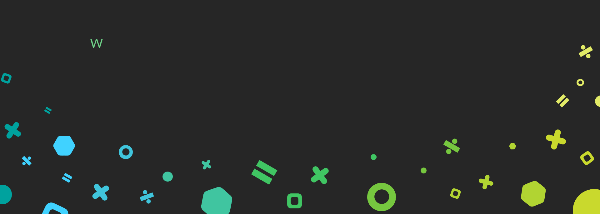

### Hi there 👋

 

## &#x1f4c8; GitHub Stats
 

   
 

### 💻 Projects
<table>
<tr><th>Machine Learning </th><th>Statistics</th></tr>
</tr><td>
    
|Title | Description |
|--|--|
| [XGBoost_EcologicalNicheModel](https://github.com/WKPhang/XGBoost_EcologicalNicheModel) |  |
</td><td>

|Title | Description |
|--|--|
| [DLNM_VectorBorneDisease](https://github.com/WKPhang/DLNM_VectorBorneDisease) | |
|[Probit-Regression-Plot](https://github.com/WKPhang/Probit-Regression-Plot) | |

</td></tr> </table>

<table>
<tr>Simple tools </tr>
</tr><td>

|Title | Description |
|--|--|
| [Amino-Acid-Haplotype-Characterization](https://github.com/WKPhang/Amino-Acid-Haplotype-Characterization) | |
| [Detach-R-Packages](https://github.com/WKPhang/Detach-R-Packages)| |
| [Image-to-Text-Converter](https://github.com/WKPhang/Image-to-Text-Converter) | |

</td></tr> </table>

<!--
**WKPhang/WKPhang** is a ✨ _special_ ✨ repository because its `README.md` (this file) appears on your GitHub profile.

Here are some ideas to get you started:

- 🔭 I’m currently working on ...
- 🌱 I’m currently learning ...
- 👯 I’m looking to collaborate on ...
- 🤔 I’m looking for help with ...
- 💬 Ask me about ...
- 📫 How to reach me: ...
- 😄 Pronouns: ...
- ⚡ Fun fact: ...
-->
